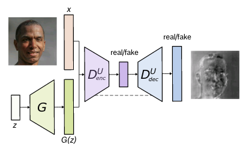
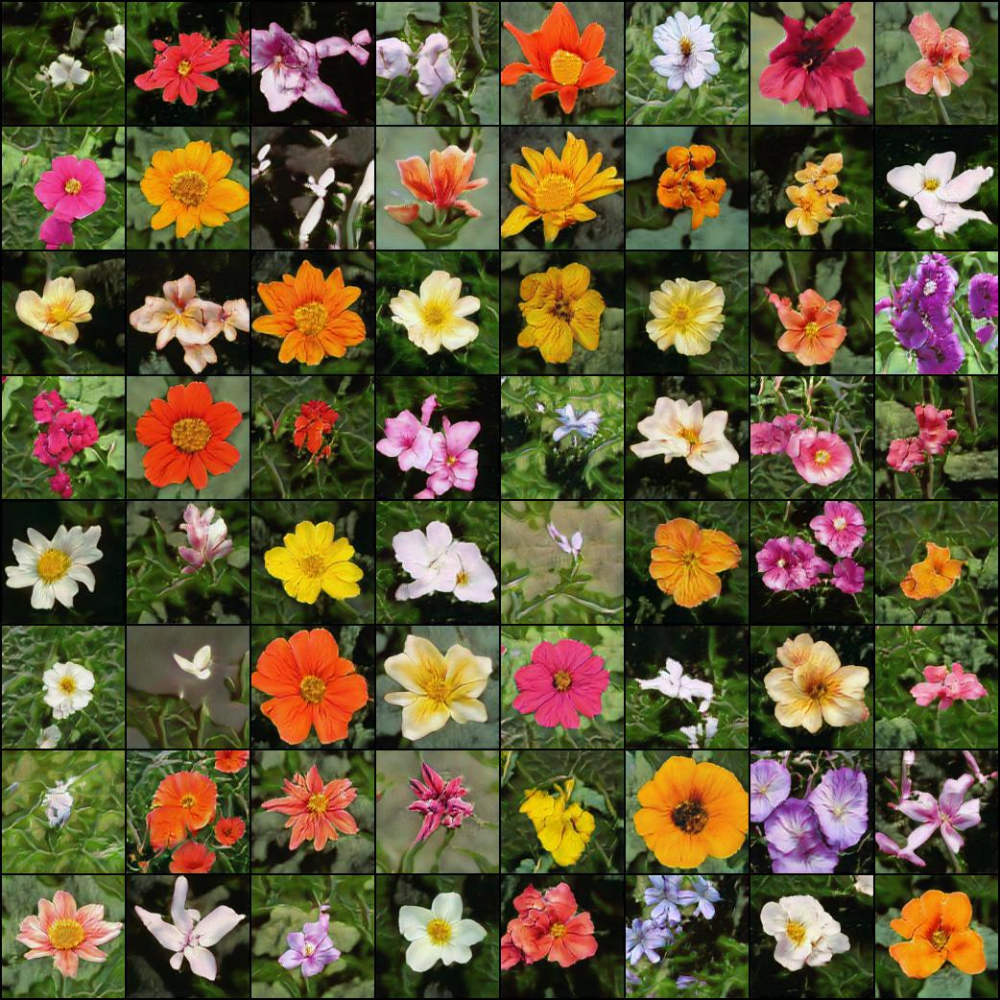
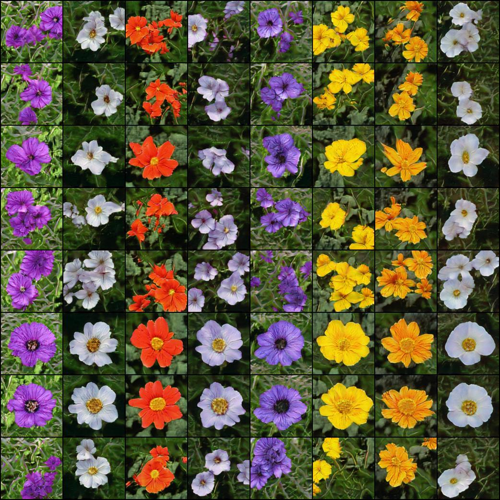

</img>

## UNet Stylegan2

An implementation of Stylegan2 with UNet Discriminator. This repository works largely the same way as <a href="https://github.com/lucidrains/stylegan2-pytorch">Stylegan2 Pytorch</a>. Simply replace all the `stylegan2_pytorch` command with `unet_stylegan2` instead.

</img>

</img>

Update: Results have been very good. Will need to investigate combining this with a few other techniques, and then I will write up full instructions for use.

## Install

```bash
$ pip install unet-stylegan2
```

## Usage

```bash
$ unet_stylegan2 --data ./path/to/data
```

## Citations

```bibtex
@misc{karras2019analyzing,
    title={Analyzing and Improving the Image Quality of StyleGAN},
    author={Tero Karras and Samuli Laine and Miika Aittala and Janne Hellsten and Jaakko Lehtinen and Timo Aila},
    year={2019},
    eprint={1912.04958},
    archivePrefix={arXiv},
    primaryClass={cs.CV}
}
```

```bibtex
@misc{schnfeld2020unet,
    title={A U-Net Based Discriminator for Generative Adversarial Networks},
    author={Edgar Schönfeld and Bernt Schiele and Anna Khoreva},
    year={2020},
    eprint={2002.12655},
    archivePrefix={arXiv},
    primaryClass={cs.CV}
}
```
